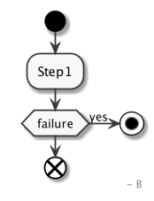

<style>
@import url('https://fonts.googleapis.com/css?family=Proxima+Nova');
section {
    font-family: 'proxima-nova', sans-serif;
    background: rgb(249, 182, 27);
}

section h1{
    font-size: 72pt;
}

section.block h1{
    color: rgb(249, 182, 27);
    text-align: center;
    font-size: 70px
}

section.gett-present {
    background: white;
    flex-direction: row;
}

section.examples {
    flex-direction: row;
}

section.examples p {
    flex: 30%;
    text-align: center;
}

section.gett-present ul {
    list-style: none;
}

section.gett-present ul li {
   margin: 15% 0;
}

section.gett-present h1, section.gett-present h3 {
    padding: 0;
    margin: 0;
}

section.gett-present h1 {
    color: rgb(249, 182, 27);
    font-size: 36px;
}

section.gett-present h3  {
    font-size: 20px;
    font-weight: normal;
    margin-top: 5px
}

section:after {
    color: rgb(249, 182, 27);
    font-size: 18px;
}

section h1, section h2{
    color: black;
}

section h2 {
  font-size: 24pt;
}

section.half ul {
  margin-left: 30%;
  margin-top: 30%;
}

section.half {
  flex-direction: row;
  background: linear-gradient(90deg, #f9b61b 50%, #FFF 50%);
}

section.half h2 {
    margin-left: 20%;
    margin-top: 40%;
}

section.white {
    background: white;
}

section.not_easy img {
    position:absolute;
    right:40px;
    width: 400px;
}

section.comparison ul {
    list-style: none;
}

section.comparison li {
    float: left;
    margin-left: 10%;
    width: 40%;
    height:100%;
}
section.comparison li img {
    vertical-align: middle;
}

section.fry img {
    position: absolute;
    right: 10%;
    top: 30%;
    width: 400px;
}

section.conspiracy p:last-child img {
  position: absolute;
  right: 5%;
  width: 301px;
}

section.shoot p:last-child img {
    position: absolute;
    right: 5%;
    top: 20%;
}

section.link a {
  color: black;
}

section.last ul {
  list-style: none;
}

section.last > ul > li {
  float: left;
  width: 50%;
}
section.last > ul > li > ul  {
    padding-left: 0;
}

.inline-block {
    flex: 50%;
}
</style>

# Business logic without pain (Go edition)

Buzlov Ilya | 2020.08.09

---
<!-- _class: half list -->

<div class="inline-block">

## Plan

</div>

<div class="inline-block">

- Introduction
- Problems
- Decision
- Questions

</div>

---
<!-- _class: gett-present -->

<div class="inline-block">

-
    # Services
    ### 180
-
    # Founded
    ### 2010
-
    # Countries
    ### Russia, Israel, United Kingdom

</div>

<div class="inline-block">

-
    # People
    ### 200
-
    # Modern
    ### Docker, Golang, React, NodeJS
-
    # Gett flexi
    ### Big part of people work from home/remotely

</div>

---


---
<!-- _class: white -->


---

<!-- _class: white -->

```go
func (o *OrderFinishedUseCase) Do(ctx context.Context, order Order) error {
    err := o.beginTransaction(ctx, order)
    if err != nil {
        err = o.runFailureFlow(ctx, err, order)
        return errors.Wrap(err, "something goes wrong, step: beginTransaction")
    }
    err = o.changeStateToFinished(ctx, order)
    if err != nil {
        err = o.runFailureFlow(ctx, err, order)
        return errors.Wrap(err, "something goes wrong, step: change state to finished")
    }
    err = o.recalculateOrderPrice(ctx, order)
    if err != nil {
        err = o.runFailureFlow(ctx, err, order)
        return errors.Wrap(err, "something goes wrong, step: recalculate order price")
    }
    err = o.redeemUserCoupons(ctx, order)
    if err != nil {
        err = o.runFailureFlow(ctx, err, order)
        return errors.Wrap(err, "something goes wrong, step: redeem user's coupons")
    }
    err = o.chargeUserCreditCard(ctx, order)
    if err != nil {
        err = o.runFailureFlow(ctx, err, order)
        return errors.Wrap(err, "something goes wrong, step: charging a user")
    }
    err = o.commitTransaction(ctx, order)
    if err != nil {
        err = o.runFailureFlow(ctx, err, order)
        return errors.Wrap(err, "something goes wrong, step: commit transaction")
    }

    return nil
}
```

---
<!-- _class: white conspiracy -->


---
<!-- _class: white -->

```golang
var (
    xZoozRequestID = "123"
    entityID       = "123"
)
ctrl := gomock.NewController(t)
lockRepo := mocks.NewMockLockRepository(ctrl)
requestRepo := mocks.NewMockRequestRepository(ctrl)
errorRepo := mocks.NewMockErrorRepository(ctrl)
logger := mocks.NewMockLogger(ctrl)
systemSettingRepo := mocks.NewMockSystemSettingRepository(ctrl)
callbackRepo := mocks.NewMockCallbackWriter(ctrl)
systemSettingRepo.EXPECT().FindIntSystemSetting(ctx, "zooz_wait_time").Return(int64(1), nil)
lockRepo.EXPECT().Create(ctx, zoozRequestLock).Return(true, nil)
lockRepo.EXPECT().Delete(ctx, zoozRequestLock).Return(true, nil)
requestRepo.EXPECT().FindByTransactionID(ctx, entityID).Return(request, nil)
requestRepo.EXPECT().UpdateStateAndSetCompletedAt(ctx, request).Return(nil)
callbackRepo.EXPECT().Write(ctx, request).Return(nil)
lockRepo.EXPECT().Create(ctx, requestLock).Return(true, nil)
lockRepo.EXPECT().Delete(ctx, requestLock).Return(true, nil)
receiver := NewCallbackReceiver(lockRepo, requestRepo, errorRepo, logger, systemSettingRepo, callbackRepo)
```

---

<!-- _class: white comparison -->

- 
- 

---
<!-- _class: white fry -->

```go
//...
if err != nil {
    return errors.Wrap(err, "something goes wrong")
}
//...
if err != nil {
    return errors.Wrap(err, "something goes wrong")
}
//...
if err != nil {
    return errors.Wrap(err, "something goes wrong")
}
//...
if err != nil {
    return errors.Wrap(err, "something goes wrong")
}
//...
if err != nil {
    return errors.Wrap(err, "something goes wrong")
}
//...
if err != nil {
    return errors.Wrap(err, "something goes wrong")
}
```


---
<!-- _class: shoot -->


---

<!-- _class: block -->


# Effe

---

- Provide visibility and traceability into these process flows
- Errors are wrapping automatically
- Dependencies build for flow automatically
- Easy flow debugging
- Easy flow extending
- Split dependencies for steps in flow: the step has only dependencies that it needs
- Allow greater reuse of existing functions
- Easy flow testing: small interface/easier to understanding what happening

---
<!-- _class: white -->

```go
func buildUser() func(UserAttributes) User {
    return func(uAttrs UserAttributes) User {
        return User{
            Email:    uAttrs.Email,
            Password: uAttrs.Password,
        }
    }
}

func createUser(userRepo UserRepository) func(context.Context, User) error {
    return func(ctx context.Context, user User) error {
        return userRepo.Create(ctx, user)
    }
}
```

---

## effe.go
<!-- _class: white -->

```go
// +build effeinject

package actions

import (
    "github.com/GettEngineering/effe"
)

func BuildCreateUserFlow(uAttrs UserAttributes) error {
    effe.BuildFlow(
        effe.Step(buildUser),
        effe.Step(createUser),
    )
    return nil
}
```

```zsh
effe
```

---

## effe_gen.go
<!-- _class: white -->
```go
// Code generated by Effe. DO NOT EDIT.

//+build !effeinject

package actions

import (
    "context"
)

type BuildCreateUserFlowFunc func(ctx context.Context, uAttrs UserAttributes)
type BuildCreateUserFlowService interface{
    //...
    //...
}
type BuildCreateUserFlowImpl struct {
    //...
    //...
}


func BuildCreateUserFlow(service BuildCreateUserFlowService) BuildCreateUserFlowFunc {
    return func(ctx context.Context, uAttrs UserAttributes) error {
        UserVal := service.BuildUser(uAttrs)
        err := service.CreateUser(ctx, UserVal)
        if err != nil {
            return errors.Wrap(err, "failed createUser")
        }
    return nil
    }
}

```

---

## Service object
<!-- _class: white -->

```go
type BuildCreateUserFlowService interface {
    BuildUser(uAttrs UserAttributes) User
    CreateUser(ctx context.Context, user User) error
}
```

---

## Testing
<!-- _class: white -->

```go

u := User{}
serviceMock := mocks.NewBuildCreateUserFlow(ctrl)
createUserFlow := BuildCreateUserFlow(serviceMock)
serviceMock.EXPECT().BuildUser(uAttrs).Return(u)
serviceMock.EXPECT().CreateUser(u).Return(nil)
err := createUserFlow(ctx, zoozRequest)
assert.NoError(t, err)
```

---

## Implementation
<!-- _class: white -->

```go
type BuildCreateUserFlowImpl struct {
    buildUserFieldFunc  func(uAttrs UserAttributes) User
    createUserFieldFunc func(ctx context.Context, user User) error
}

func(b *BuildCreateUserFlowImpl) BuildUser(uAttrs UserAttributes) User {
    return b.buildUserFieldFunc(uAttrs)
}
```

---

## Dependencies
<!-- _class: white -->

```go
func NewBuildCreateUserFlowImpl(userRepo UserRepository) *BuildCreateUserFlowImpl {
    return &BuildCreateUserFlowImpl{buildUserFieldFunc: buildUser(), createUserFieldFunc: createUser(userRepo)}
}
```

---
<!-- _class: half list -->

<div class="inline-block">

## API

</div>

<div class="inline-block">

- Step
- Wrap
- Decision
- Failure

</div>

---

## Wrap
<!-- _class: white -->

```go
func BuildCreateUserFlow(uAttrs UserAttributes) error {
    effe.BuildFlow(
        //...,
        effe.Wrap(effe.Before(beginTransaction), effe.Success(commitTransaction), effe.Failure(rollbackTransaction),
            effe.Step(createUser),
        )
        //...,
    )
    return nil
}
```

---

## Generated code
<!-- _class: white -->

```go
//...
err16 := func(ctx context.Context, user User) error {
  transaction err15 := service.BeginTransaction(ctx)
  if err15 != nil {
    err15 = service.RollbackTransaction(ctx, err15, transaction)
    return errors.Wrap(err15, "failed beginTransaction")
  }

  err14 := service.CreateUser(ctx, user)
  if err != nil {
    err14 = service.RollbackTransaction(ctx, err15, transaction)
    return errors.Wrap(err14, "failed createUser")
  }

  err13 := service.CommitTransaction(transaction)
  if err != nil {
    err13 = service.RollbackTransaction(ctx, err13, transaction)
    return  errors.Wrap(err13, "failed commitTransaction")
  }
  return nil
}
//...
```

---
<!-- _class: white -->

## Decision

```go
func BuildCreateUserFlow(uAttrs UserAttributes) error {
    effe.BuildFlow(
        //....,
            effe.Decision(new(entities.LockCreated),
                effe.Case(false, effe.Step(stop())),
                effe.Case(true,
                    effe.Step(createUser),
                    effe.Step(createCustomer),
                ),
        //....,
    )
    return nil
)
```

---

## Generated code

<!-- _class: white -->

```go
//...
err15 = func(lockCreatedVal entities.LockCreated, user User) error {
   switch lockCreatedVal {
      case true:
        err := func(ctx context.Context) {
          err = createUser(user)
          if err != nil {
            return errors.Wrap("failed createUser")
          }
          err = createCustomer(user)
          if err != nil {
            return errors.Wrap("failed createUser")
          }
        }()
      case false:
        service.Stop()
        return nil
      default:
        return errors.New("unsupported type lockCreatedVal")
   }
}
//...
```

---
<!-- _class: half list -->

<div class="inline-block">

## Failure

</div>

<div class="inline-block">

- BuildFlow
- Wrap
- Decision

</div>

---

## Flow
<!-- _class: white -->

```go
func BuildCreateUserFlow(uAttrs UserAttributes) error {
    effe.BuildFlow(
        effe.Step(buildUser),
        effe.Step(createUser),
        effe.Failure(handleErr),
    )
    return nil
)
```

---
<!-- _class: white -->

## Generated

```go
func BuildCreateUserFlow(service BuildCreateUserFlowService) BuildCreateUserFlowFunc {
    return func( ctx context.Context, uAttrs UserAttributes) error {
        UserVal := service.BuildUser(uAttrs)
        err := service.CreateUser(ctx, UserVal)
        if err != nil {
            err = service.HandleErr(err)
            return errors.Wrap(err, "failed createUser")
        }
    return nil
    }
}
```

---

<!-- _class: block -->


# Customization

---
<!-- _class: white -->

```go
func BuildMyFlow() error {
    effe.BuildFlow(
        effe.Step(step1),
        mygenerator.POST(
            "http://example.com",
        ),
    )
    return nil
}

```

---
<!-- _class: white -->
## DSL

```go
package mygenerator

import (
  "github.com/GettEngineering/effe"
)

func POST(url string) interface{} {
    panic("implementation is not generated, run myeffe")
}

func LoadPostRequestComponent(effeConditionCall *ast.CallExpr, f loaders.FlowLoader) (types.Component, error) {
    return &PostRequestComponent{
        URI: effeConditionCall.Args[0],
    }, nil
}

func GenPostRequestComponent(f strategies.FlowGen, c types.Component) (strategies.ComponentCall, error) {
    component, ok := c.(*PostRequestComponent)
    if !ok {
        return nil, errors.Errorf("component %s is not a component with type PostRequestComponent", component.Name())
    }
    return &postComponentCall{
        input:  &ast.FieldList{},
         output: output,
        fn:     fn,
    }
}
```

---

<!-- _class: white -->
## Generator

```go
    settings := generator.DefaultSettigs()
    strategy := strategies.NewChain(strategies.WithServiceObjectName(settings.LocalInterfaceVarname()))
    err := strategy.Register("POST", GenPostRequestComponent)
    require.NoError(t, err)

    loader := loaders.NewLoader(loaders.WithPackages([]string{"effe", "testcustomization"}))
    err = loader.Register("POST", LoadPostRequestComponent)
    require.NoError(t, err)

    gen := generator.NewGenerator(
        generator.WithSetttings(settings),
        generator.WithLoader(loader),
        generator.WithStrategy(strategy),
    )
```

---
<!-- _class: white -->

```golang
func C(service CService) CFunc {
	return func() (*gentleman.Response, error) {
		err := service.Step1()
		if err != nil {
			return nil, err
		}
		responsePtrVal, err := func() (*gentleman.Response, error) {
			cli := gentleman.New()
			cli.URI("http://example.com")
			req := cli.Request()
			req.Method(POST)
			return cli.Send()
		}()
		if err != nil {
			return responsePtrVal, err
		}
		return responsePtrVal, nil
	}
}
```

---

<!-- _class: block -->


# Reusing

---

<!-- _class: white -->

```golang
func A() error {
    effe.BuildFlow(
        effe.Step(B),
        effe.Step(C),
    )
    return nil
}
func B() error {
    effe.BuildFlow(
        effe.Step(step1),
    )
    return nil
}
func C() error {
    effe.BuildFlow(
        effe.Step(B),
    )
    return nil
}

```

---

<!-- _class: block -->


# Diagrams

---
<!-- _class: white -->

```golang
//go:generate go run ../../cmd/effe/main.go
//go:generate go run ../../cmd/effe/main.go -d -out ./doc/
```

```bash
$ effe -d -out ./doc
effe: wrote foo/doc/B.plantuml
effe: wrote foo/doc/C.plantuml
effe: wrote A.plantuml
```

---
<!-- _class: white examples -->





---
<!-- _class: white link last -->

-
  - https://github.com/GettEngineering/effe/
  - 
- 
